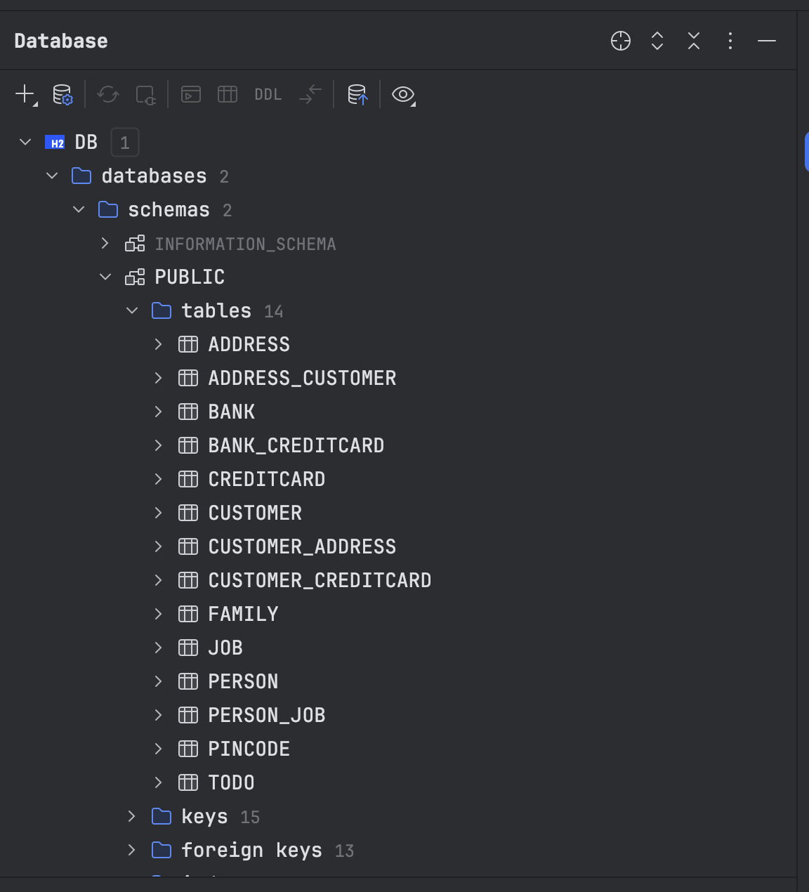

### Task 1

I had some problems with the Jpa Test. In the tutorial it was stated to make changes to a pom.xml file. These files are usually conatined in a maven project so I was quite confused by this. By looking deeper into the code i concluded that i needed to make changes to the [persistence.xml]() file.

```xml
        <class>no.hvl.dat250.jpa.tutorial.relationshipexample.Family</class>
        <class>no.hvl.dat250.jpa.tutorial.relationshipexample.Job</class>
        <class>no.hvl.dat250.jpa.tutorial.relationshipexample.Person</class>
```

Once this was set up i did not have issues with the JpaTest.

### Experiment 2


Code for the experiment can be found here:

- [Address.java](https://github.com/CBKarlsen/dat250-jpa-tutorial/blob/master/src/main/java/no/hvl/dat250/jpa/tutorial/creditcards/Address.java)
- [CreditCard.java](https://github.com/CBKarlsen/dat250-jpa-tutorial/blob/master/src/main/java/no/hvl/dat250/jpa/tutorial/creditcards/CreditCard.java)
- [Bank.java](https://github.com/CBKarlsen/dat250-jpa-tutorial/blob/master/src/main/java/no/hvl/dat250/jpa/tutorial/creditcards/Bank.java)
- [Pincode.java](https://github.com/CBKarlsen/dat250-jpa-tutorial/blob/master/src/main/java/no/hvl/dat250/jpa/tutorial/creditcards/Pincode.java)
- [Customer.java](https://github.com/CBKarlsen/dat250-jpa-tutorial/blob/master/src/main/java/no/hvl/dat250/jpa/tutorial/creditcards/Customer.java)
- [CreditCardsMain.java](https://github.com/CBKarlsen/dat250-jpa-tutorial/blob/master/src/main/java/no/hvl/dat250/jpa/tutorial/creditcards/driver/CreditCardsMain.java)

_Explain the used database and how/when it runs._

The database is H2 and is created when the program is run. In the persistence.xml file the line

```xml
    <property name="hibernate.hbm2ddl.auto"value="create" >
```

Shows that the database is created when the program is run, if the value was "update" then the database would be updated instead of created each time.

_Can you provide the SQL used to create the table Customer?_

```sql
CREATE TABLE Customer (
    id BIGINT AUTO_INCREMENT PRIMARY KEY,
    name VARCHAR(255)
);
```


*Find a way to inspect the database tables being created and create a database schema in your report. Do the created tables correspond to your initial thoughts regarding the exercise?*
<br>



By using the built in functions from IntelliJ this was quite easy. The tables created correspond to my initial thoughts regarding the exercise. The tables are created as expected and the relationships between the tables are also as expected.


### Problems

I had som trivial problems with a getter in the customer file not working correctly. Several hours were spent on finding the small bug. When found it was a simple fix.
<br>
I had no huge problems other than som small issues with the code, main issues where small faults from syntax errors and such.


